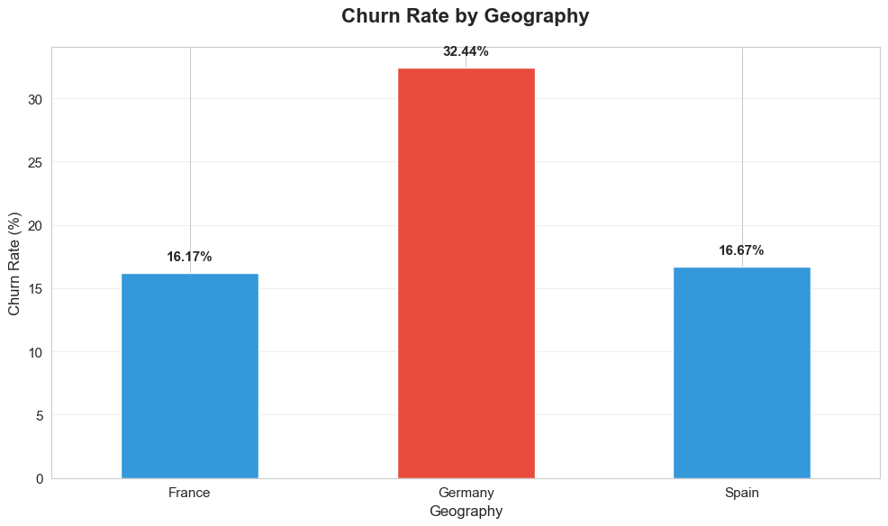
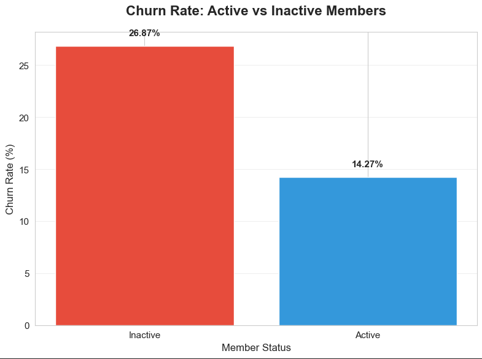
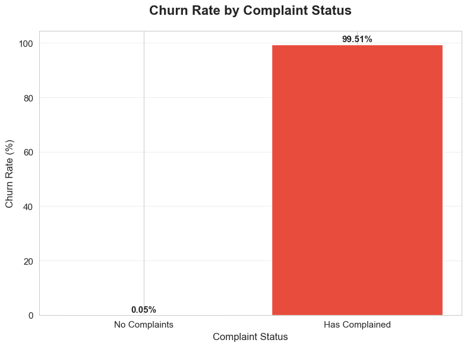
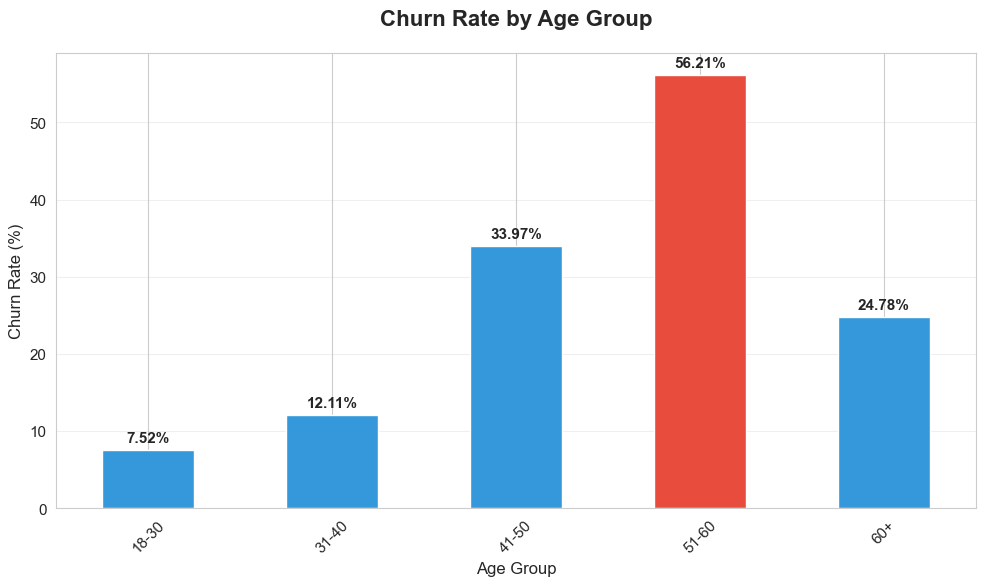
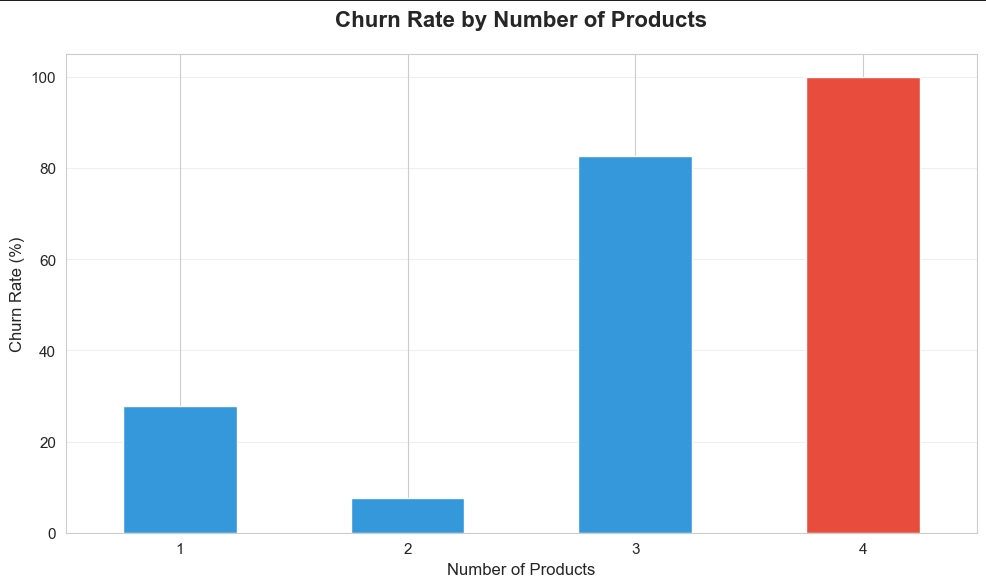

# Bank Customer Churn Analysis

Analysis of customer churn patterns in banking using SQL and Python to identify factors that drive customer retention.

## Quick Start

**Just want to see the analysis?** Click on [`Bank_Churn_Analysis.ipynb`](Bank_Churn_Analysis.ipynb) to view the full notebook with all visualizations and code.

**Want to run it yourself?** See the [setup instructions](#setup) below.

## About This Project

I built this project to demonstrate SQL and Python data analysis skills, focusing on a real business problem in banking. Customer churn is expensive - it costs 5-7x more to acquire new customers than retain existing ones - so understanding what drives customers to leave is valuable.

The analysis uses a synthetic dataset of 10,000 bank customers and combines SQL queries with Python analysis to uncover patterns in churn behavior.

## Tech Stack

- **Python** (Pandas, NumPy, Matplotlib, Seaborn)
- **SQL** (SQLite)
- **Jupyter Notebook**

## Dataset

Using the [Bank Customer Churn dataset from Kaggle](https://www.kaggle.com/datasets/radheshyamkollipara/bank-customer-churn), which includes customer demographics, account details, product usage, and whether they churned.

## Analysis Approach

The notebook walks through:

1. SQL queries to extract and aggregate customer data
2. Data cleaning and validation in Python
3. Statistical analysis to identify churn patterns
4. Visualizations showing key findings
5. Business recommendations based on the data

I focused on making the insights actionable - not just "churn is bad" but specifically where it's happening and what might help.

## What I Found

A few interesting patterns emerged:

- **Geography matters**: Germany has 2x the churn rate of France or Spain (32% vs 16%)



- **Activity is key**: Inactive members churn at nearly double the rate of active ones



- **Complaints are a red flag**: Customers who complained show dramatically higher churn



- **Age patterns**: Middle-aged customers (40-60) churn more than younger or older segments



- **Product paradox**: Having more products doesn't always mean more loyalty - customers with 3-4 products actually showed higher churn



## Project Structure

```
bank-customer-churn-analysis/
├── data/
│   ├── Customer-Churn-Records.csv
│   └── bank_churn.db
├── Bank_Churn_Analysis.ipynb
├── load_data.py
├── requirements.txt
└── README.md
```

## Setup

If you want to run the notebook locally:

1. Clone the repo
```bash
git clone https://github.com/YOUR_USERNAME/bank-customer-churn-analysis.git
cd bank-customer-churn-analysis
```

2. Install dependencies
```bash
pip install -r requirements.txt
```

3. Load the data into SQLite
```bash
python load_data.py
```

4. Open the notebook
```bash
jupyter notebook Bank_Churn_Analysis.ipynb
```

## Requirements

- Python 3.8+
- pandas, numpy, matplotlib, seaborn, jupyter
- sqlite3 (comes with Python)

## What's Next

Some ideas for extending this project:
- Build a predictive model to identify at-risk customers before they churn
- Add time-series analysis to see how churn patterns change over time
- Test retention strategies with A/B testing framework

## About Me

I'm Jamyang Ponsar, a recent Computer Science grad from Stony Brook University interested in data science and analytics.

[LinkedIn](https://linkedin.com/in/jamyangponsar) | [GitHub](https://github.com/JamPonsar)
